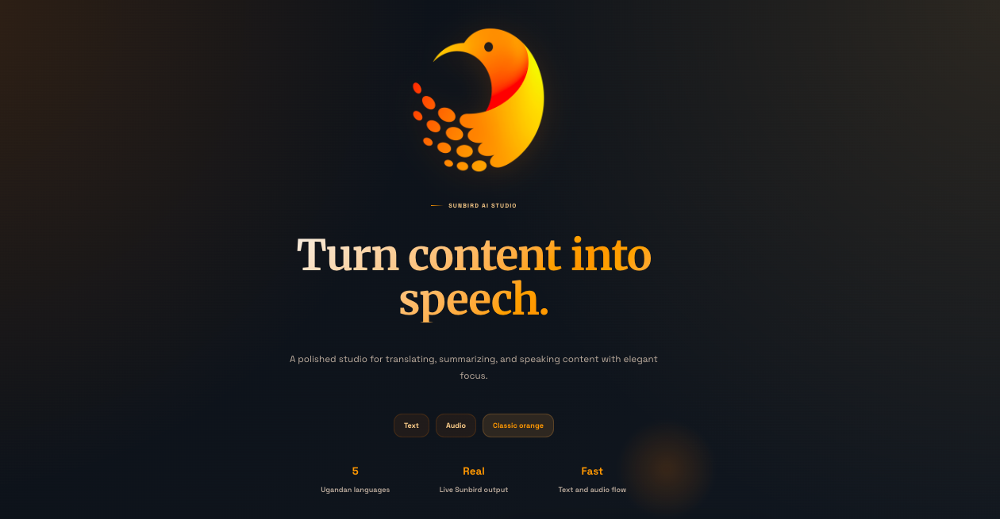
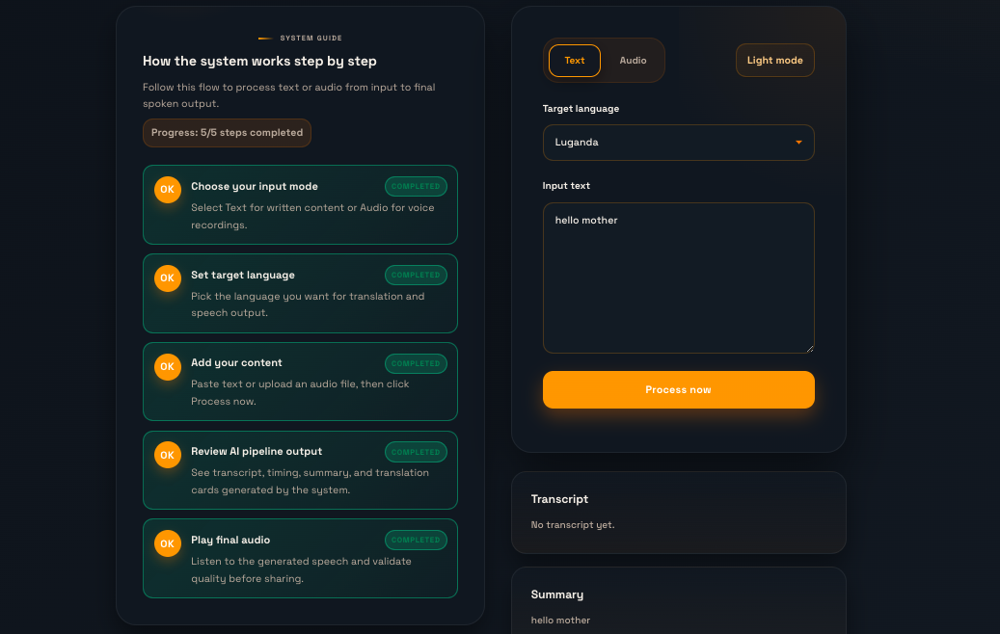
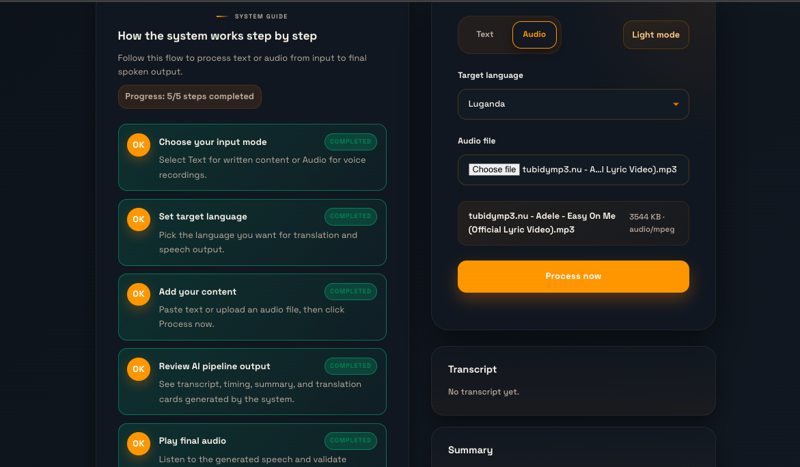
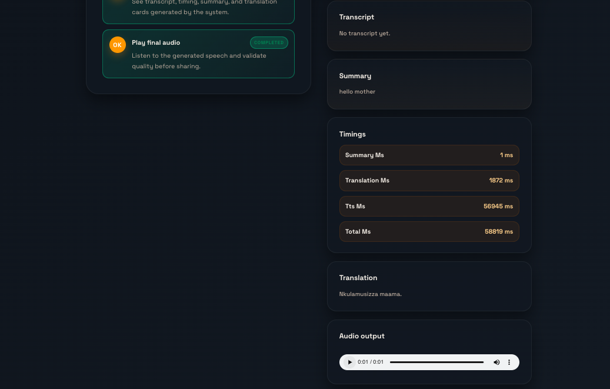

# Sunbird AI Internship Assessment

## Project Description

This project is a Sunbird AI web application that accepts either typed text or an uploaded audio file, processes the input through transcription, summarisation, translation into a selected Ugandan language, and text-to-speech synthesis, and then displays every intermediate result in the UI.

The application features an interactive step-by-step guide that highlights the current workflow step based on user progress, providing a seamless and intuitive user experience.

---

## Deployed Link

**Live Application:** [https://internship-assessmentsunbird.vercel.app/](https://internship-assessmentsunbird.vercel.app/)

---

## Architecture Overview

```
Text input ────────────────────────────────────────────────────┐
                                                                │
Audio input → Speech-to-Text (audio only) → Summarise → Translate → Text-to-Speech → Output
```

The active web pipeline is implemented in the Next.js API routes:
- **Text Processing:** `app/api/process-text/route.ts`
- **Audio Processing:** `app/api/process-audio/route.ts`

Both summarisation and translation use Sunbird AI's **Sunflower Simple Inference** endpoint (`/tasks/sunflower_simple`) with `model_type: "qwen"`.

---

## Local Setup

### Prerequisites

- Node.js 18+ and npm
- Python 3.9+
- Git
- Sunbird AI API Token

### Installation Steps

1. **Clone the Repository**

   ```bash
   git clone https://github.com/<your-username>/internship-assessment.git
   cd internship-assessment
   ```

2. **Create and Activate Python Virtual Environment**

   ```bash
   # macOS/Linux
   python -m venv venv
   source venv/bin/activate

   # Windows
   python -m venv venv
   venv\Scripts\activate.bat
   ```

3. **Install Dependencies**

   ```bash
   npm install
   pip install -r requirements.txt
   ```

4. **Configure Environment Variables**

   ```bash
   cp .env.example .env.local
   ```

   Add your Sunbird API token to `.env.local`:

   ```
   SUNBIRD_API_TOKEN=your_token_here
   NEXT_PUBLIC_API_URL=http://localhost:5000
   ```

5. **Start the Application**

   ```bash
   npm run dev
   ```

   Open [http://localhost:3000](http://localhost:3000) in your browser.

---

## Environment Variables

| Variable                | Required | Purpose                                                    |
| ----------------------- | -------- | ---------------------------------------------------------- |
| `SUNBIRD_API_TOKEN`     | Yes      | Authorises requests to Sunbird AI APIs                     |
| `NEXT_PUBLIC_API_URL`   | No       | Optional frontend API base URL override (default: `/api`)  |

See `.env.example` for the exact local development template.

---

## Usage

1. **Choose Input Mode:** Select either "Text" or "Audio"
2. **Paste or Upload:** Enter text content or upload an audio file
3. **Select Target Language:** Choose from Luganda, Runyankole, Ateso, Lugbara, or Acholi
4. **Process:** Click the "Process now" button
5. **Review Results:** View the transcript, summary, timing metrics, translation, and generated audio output

The **System Guide** on the left shows your progress through each step, automatically highlighting which stage of the workflow you're currently on.

---

## Screenshots

### Hero Section & System Guide

The application features a centered layout with the interactive system guide on the left and input controls on the right.



### Text Input State

Users can enter text content and select their target language before processing.



### Audio Upload State

Support for audio file uploads with automatic transcription before summarisation and translation.



### Output Results Panel

The results panel displays transcript, timing metrics, summary, translation, and generated audio output below the input fields.



---

## Known Limitations

- **Audio file size:** Files longer than 5 minutes are rejected in the browser before upload
- **Language support:** Only the five target languages shown in the UI are supported (Luganda, Runyankole, Ateso, Lugbara, Acholi)
- **Deployment startup:** The deployed Vercel app may take a moment to wake up on the free tier, so the first request can be slower than later requests
- **Audio quality:** Very noisy audio can reduce transcription quality, which then affects the summary, translation, and generated speech
- **Backend requirement:** The application requires a running backend API server to process requests

---

## Verification Notes

- **Part 1 exercises** are covered by `tests/test_basics.py`
- **The Sunbird pipeline** uses the Sunflower endpoint for summarisation and translation in the Next.js API routes
- **Interactive guide** automatically tracks progress through the 5-step workflow based on user interactions

---

## Technology Stack

- **Frontend:** Next.js 13+, React, TypeScript, CSS3 (with CSS variables)
- **Backend:** Python (Flask/FastAPI pattern in API routes), Node.js API routes
- **APIs:** Sunbird AI Sunflower Simple Inference
- **Deployment:** Vercel
- **Styling:** Custom CSS with dark mode support

---

## Support & Issues

For issues or questions, please refer to the project structure or contact the Sunbird AI team.

4. **Get Your Sunbird AI API Token**
   - Go to [Sunbird AI Portal](https://app.sunbird.ai/)
   - Create an account or sign in
   - Generate a new API token
   - Copy the token

5. **Configure Environment**

   ```bash
   # Copy the example file
   cp .env.example .env.local

   # Edit .env.local and add your Sunbird API token
   # NEXT_PUBLIC_SUNBIRD_API_TOKEN=sk_...
   ```

Note: If you do not set `SUNBIRD_API_TOKEN`, the backend will run in a local "mock" mode that returns canned
responses for transcription, summarization, translation, and TTS. This is useful for development and tests
when you don't have a real Sunbird API token yet.

---

## Part 1: Programming Exercises ✅

**Status**: All tests passing!

### Completed Functions

**`collatz(n: int) -> List[int]`**  
Implements the Collatz conjecture: repeatedly divide even numbers by 2, multiply odd numbers by 3 and add 1, until reaching 1. Returns the sequence of all values.

```python
def collatz(n: int) -> List[int]:
    result = []
    while n != 1:
        result.append(n)
        if n % 2 == 0:
            n = n // 2
        else:
            n = n * 3 + 1
    result.append(1)
    return result
```

**`distinct_numbers(numbers: List[int]) -> int`**  
Counts unique values in a list using Python's `set()`.

```python
def distinct_numbers(numbers: List[int]) -> int:
    return len(set(numbers))
```

### Running Tests

```bash
pytest tests/test_basics.py -v
# Output: 5 passed in 0.23s ✅
```

---

## Part 2: GenAI Application with Sunbird AI ✅

**Status**: Application ready for local testing and deployment!

### Architecture

**Frontend**: Next.js 14 (React 18, TypeScript)  
**Backend**: Python serverless functions (Vercel runtime)  
**APIs**: Sunbird AI (STT, Summarization, Translation, TTS)

### Pipeline

```
User Input (Text/Audio)
    ↓
[STT if audio] → [Summarize] → [Translate] → [TTS]
    ↓
Display Results (Transcript, Summary, Translation, Audio)
```

### Features Implemented

- ✅ Text input support
- ✅ Audio file upload (max 5 minutes)
- ✅ 5 Ugandan language support (Luganda, Runyankole, Ateso, Lugbara, Acholi)
- ✅ Real-time processing pipeline
- ✅ Error handling & validation
- ✅ Responsive UI with modern styling
- ✅ Audio player for output

### Running Locally

```bash
# Start development server
npm run dev

# Open browser
# http://localhost:3000
```

For detailed setup, see [PROJECT_README.md](PROJECT_README.md)

### Project Structure

```
.
├── app/                      # Next.js Frontend
│   ├── page.tsx             # Main UI component
│   ├── layout.tsx           # Root layout
│   └── globals.css          # Styles
├── api/                      # Python Backend (Vercel Serverless)
│   ├── index.py             # API routing
│   ├── sunbird_client.py    # Sunbird AI wrapper
│   └── pipeline.py          # Processing pipeline
├── exercises/               # Part 1 (Programming exercises)
│   └── basics.py
├── tests/                   # Part 1 tests
│   └── test_basics.py
├── package.json             # Node.js dependencies
├── requirements.txt         # Python dependencies
├── next.config.js           # Next.js config
├── vercel.json              # Vercel deployment config
├── .env.example             # Environment template
├── PROJECT_README.md        # Part 2 documentation
└── README.md                # This file
```

---

## Part 3: Deployment 🚀

### Option A: Deploy to Vercel (Recommended for Next.js)

Vercel is the official Next.js hosting platform and supports both Next.js frontend and Python backend functions.

#### Step 1: Prepare Your Code

Ensure all files are committed to Git:

```bash
git add .
git commit -m "Complete internship assessment parts 1-3"
git push origin main
```

#### Step 2: Create Vercel Account & Link Project

```bash
# Use the CLI without a global install
npx vercel login

# Link project
npx vercel link
```

When prompted:

- **Found existing project**: Say No (to create new)
- **Project name**: `internship-assessment`
- **Directory**: `.` (current)

#### Step 3: Add Environment Variables

```bash
# Add the Sunbird API token in the Vercel dashboard
# Project Settings -> Environment Variables
# Key: SUNBIRD_API_TOKEN
# Value: sk_...
```

#### Step 4: Deploy

```bash
# Preview deployment (staging)
vercel

# Production deployment
vercel --prod
```

Vercel will:

1. Build Next.js frontend
2. Install Python dependencies from `requirements.txt`
3. Deploy Python API functions to serverless runtime
4. Provide a live URL: `https://internship-assessment-xxxxx.vercel.app`

#### Step 5: Test Live App

Visit the provided URL and test the full pipeline with text/audio inputs.

---

### Option B: Deploy to Hugging Face Spaces (For Streamlit/Gradio)

If you prefer a simpler UI framework, Hugging Face Spaces is excellent:

#### For Streamlit or Gradio:

1. Create account: https://huggingface.co/join
2. Create new Space: https://huggingface.co/new-space
   - Choose **Streamlit** or **Gradio**
   - Set to **Public**
3. Add secret: Space settings → Variables and secrets → New secret
   - Name: `SUNBIRD_API_TOKEN`
   - Value: Your Sunbird API token
4. Push code:
   ```bash
   git remote add space https://huggingface.co/spaces/your-username/your-space
   git push space main
   ```

---

## Submission Checklist ✅

- [ ] Part 1: All 5 tests passing
- [ ] Part 2: Application code complete (Next.js + Python backend)
- [ ] Part 3: Updated README with setup instructions
- [ ] Part 3: Environment variables documented in `.env.example`
- [ ] Part 3: Code deployed and live (Vercel or Hugging Face)
- [ ] Part 3: Deployment link added to this README

---

## Environment Variables Reference

| Variable              | Required | Example                 | Notes                                 |
| --------------------- | -------- | ----------------------- | ------------------------------------- |
| `SUNBIRD_API_TOKEN`   | Yes      | `sk_...`                | Your Sunbird AI API token             |
| `NEXT_PUBLIC_API_URL` | No       | `http://localhost:3000` | Frontend API endpoint (auto-detected) |

---

## API Endpoints

| Endpoint             | Method | Purpose                        |
| -------------------- | ------ | ------------------------------ |
| `/api/process-text`  | POST   | Process text through pipeline  |
| `/api/process-audio` | POST   | Process audio through pipeline |
| `/api/health`        | GET    | Health check                   |

---

## Troubleshooting

### "Module not found" errors

```bash
# Reinstall dependencies
pip install -r requirements.txt
npm install
```

### "SUNBIRD_API_TOKEN not set"

```bash
# Check .env.local file exists
cat .env.local

# Verify token is set
echo $NEXT_PUBLIC_SUNBIRD_API_TOKEN  # Linux/Mac
echo %NEXT_PUBLIC_SUNBIRD_API_TOKEN%  # Windows
```

### Tests failing

```bash
# Run tests with verbose output
pytest tests/ -v

# Make sure venv is activated and requirements.txt installed
```

### Build errors on Vercel

- Ensure `requirements.txt` is in project root
- Check `package.json` exists with correct build script
- Verify `api/` directory has Python files

---

## Resources

- [Sunbird AI Docs](https://docs.sunbird.ai/)
- [Next.js Documentation](https://nextjs.org/docs)
- [Vercel Deployment Guide](https://vercel.com/docs)
- [Python API Handlers on Vercel](https://vercel.com/docs/functions/runtimes/python)

---

## Additional Documentation

For detailed information on Part 2 (application features, usage, architecture):  
👉 **See [PROJECT_README.md](PROJECT_README.md)**

---

**Last Updated**: May 9, 2026  
**Assessment Status**: 🟢 In Progress (Parts 1 & 2 Complete, Part 3 Pending Deployment)
